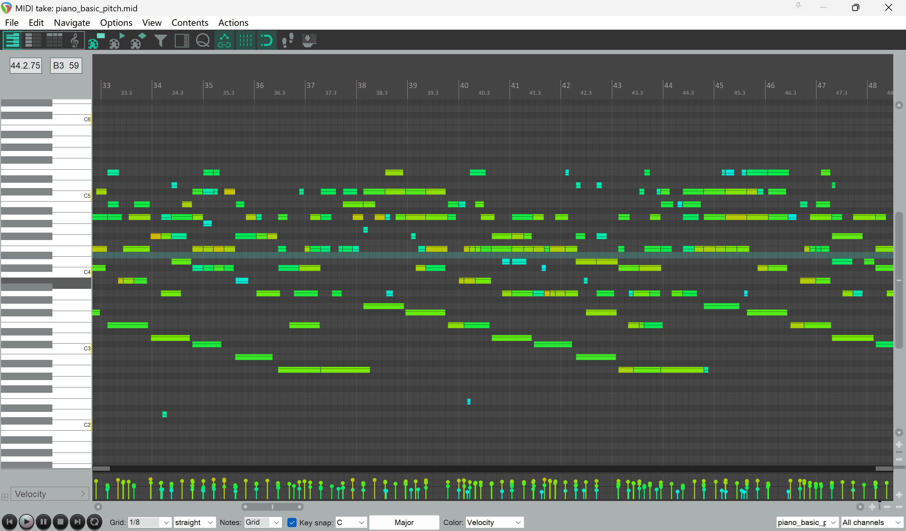

# 寻找主旋律抓取模型

1. 给定一首歌，能否从中提取出完整的旋律？因为人可以一直哼一首歌，每个时间点，只会有一个音符。
2. 给定 vocal，能否从中提取出旋律？相当于任务 1 的退化版本
3. 给定四大件，能否直接提取出 MIDI 复刻他？ basic-pitch 应该就可以所有的。
    - 钢琴：应该是最简单的，因为声音非常纯
    - guitar：比较难，因为 guitar 有各种样式，实录噪音蛮大的
    - bass: 难，除非 bass 谈的很大声，否则 bass 本身的存在感就比较低
    - drums: 应该可以，因为鼓点的旋律非常大


[Some notes on Automated Audio Transcription (AAT) / Automated Music Transcription (AMT) (aka: converting audio to midi)](https://gist.github.com/0xdevalias/f2c6e52824b3bbd4fb4c84c603a3f4bd)


## 任务结果总结与更深入行动方向

直接从歌曲中提取 melody: 放弃
从 vocal 中提取 melody: SOME
从 piano 中提取 chords: transkun

在探索这些仓库的时候，发现最大的问题就是：
1. 一个同音高音节会被切断，导致音符太碎
2. drums 乐器不能直接使用基于 pitch 的检测方案

导致 basic-pitch 基本上是不可用的状态


## 相关仓库
### Base Pitch

Spotify 出品的音乐工具。
prefer 这个，因为大家都在使用。

这个配合 BS-RoFormer 提取出来的钢琴，非常干净，可以考虑做出一个模块集成进去
我放到 `~/project/music-models/basic-pitch-mcp` 里面，用 uv 安装了

```shell
uv run basic-pitch ./midi/ ./audio/river.wav
```

直接转音频到 MIDI，
我先看一下钢琴的效果


### Omnizart

* Omnizart (Vocal/Melody Mode):
    * 特点: 一个综合性的音乐转录工具。它的 Melody 模块基于深度学习（U-Net结构），专门针对多复调音频中的主旋律进行训练。
    * 优势: 效果比传统的信号处理算法（如 Melodia）更现代，抗噪性更好。

还没有尝试，打算试一下

### MR-MT3

还没有尝试

* MT3 (Multitrack Music Transcription) / MR-MT3:
    * 特点: Google Magenta 出品，可以直接把一首混音好的歌变成多轨 MIDI（Drums, Piano, Bass 等分开）。
    * 优势: 一步到位，但计算资源消耗大，且对非标准乐器可能识别不准。

太大了

### librosa

这个库是一个 CPU 的，处理 vocal 中的音高，再转 MIDI。

但是 gemini 给出的脚本会导致因为 frame 级别的转录，会导致人的音有波动，可能一点点不稳定的气息，被识别出跨 8 度的音。
你会看到很碎的音符


### melodia

方案 A：专用主旋律提取 (最符合你的“能量”概念)
这类算法专门寻找“最显著的音高线”，无论它来自人声、合成器还是吉他独奏。

* Melodia (from Essentia库):
    * 特点: 工业界最经典的“主旋律提取”算法。它不区分乐器，只关注“人耳最容易听到的那个旋律线”。
    * 优势: 完美解决 Vocal 空白时，自动抓取由 Piano 或 Guitar 演奏的 Fill-in 旋律。
    * 部署: Python essentia-tensorflow 库。

这个库比较老了，当时用 Python2 的，基于了一个算法


## 特定任务细分
### 从一首 music 中提取最强音符

#### basic-pitch

basic-pitch 不做任何参数调整，直接导出 midi，会非常碎，
人声音和钢琴声音什么都混在一起了

### 从 vocal 中提取 midi

#### Omnizart

慢，特别慢，估计用了 CPU
效果比 basic-pitch 略微好了一点儿，但是问题依旧存在，
最关键的问题是，一个字，会有多个同音调的音

#### basic-pitch 

不调参，直接转 人声音，也是非常的碎

#### basic-pitch 加入参数：

```bash
uv run basic-pitch ./output/ ./audio/vocals.wav \
  --save-midi \
  --minimum-note-length 160 \
  --onset-threshold 0.6 \
  --frame-threshold 0.3 \
  --minimum-frequency 80 \
  --maximum-frequency 1000
```

有如下问题：
1. 人背景有和声的情况下，稳定的背景和声也被转录成了 MIDI，导致同一时间有两个 MIDI notes
2. 人的 发音，有时候会颤抖（音高变化），有时候一口气不太连续（一个音好几个同音高断开的音符）

总之，没法每个时间点，只有一个音符

####  rosvot

```python
python inference/rosvot.py -o [path-to-result-directory] -p [path-to-the-wave-file]
uv run python inference/rosvot.py -o midi -p audio/vocal.wav
```

不好，同一个音，还是存在分开的

#### SOME

[openvpi/SOME: SOME: Singing-Oriented MIDI Extractor.](https://github.com/openvpi/SOME?tab=readme-ov-file)

```
python infer.py --model CKPT_PATH --wav WAV_PATH
uv run python infer.py --model ./ckpt/ --wav ./audio/vocals.wav
```

确实是最好的模型了。
但是观察你会发现，有个问题是：人在唱歌的时候，一个字是会跨音域的，导致一个字，会有好几个 midi note。

但是这不重要，这已经是 sota 了。

### 钢琴 wav => midi

#### basic-pitch 

```shell
uv run basic-pitch ./midi/ ./audio/piano.wav
```

我觉得有点儿太碎了，不知道是不是真的是这样，感觉不太连贯



#### transkun


我觉得是 best 的了，优于 basic-pitch。
对于长音没有断开的，能够清晰地看出柱式和弦 以及 分解和弦

```bash
transkun input.mp3 output.mid --device cuda
transkun audio/piano.wav midi/piano.mid --device cuda
```

### drums wav=> midi

我用 basic-pitch 试过了，drums 不是普通的 midi note

目前暂时没有发现好的开源项目提取鼓组，得自己写

TODO，有一些项目，或许不用 AI 也可以做到：

[skittree/DrummerScore: Automatic Drum Transcription software project.](https://github.com/skittree/DrummerScore)

[yoshi-man/DrumTranscriber](https://github.com/yoshi-man/DrumTranscriber)

#### MIDIfren

```sh
# convert audio file to midi directly and listen (no stem extraction)
uv run python MIDIfren.py -i ./audio/drums.wav --type drums --midi 
```


不好用


#### basic-pitch

```sh
uv run basic-pitch ./midi/ ./audio/drums.wav
```

basic pitch 无法提取鼓点的 midi，鼓组严格来说，不是 MIDI

#### midi-Extractor

垃圾不知道是不是 AI 写得

https://github.com/michael-koscak/midi-extractor.git

```sh
uv run python convert.py ./audio/drums.wav ./midi/drums.mid --mode drums 
```